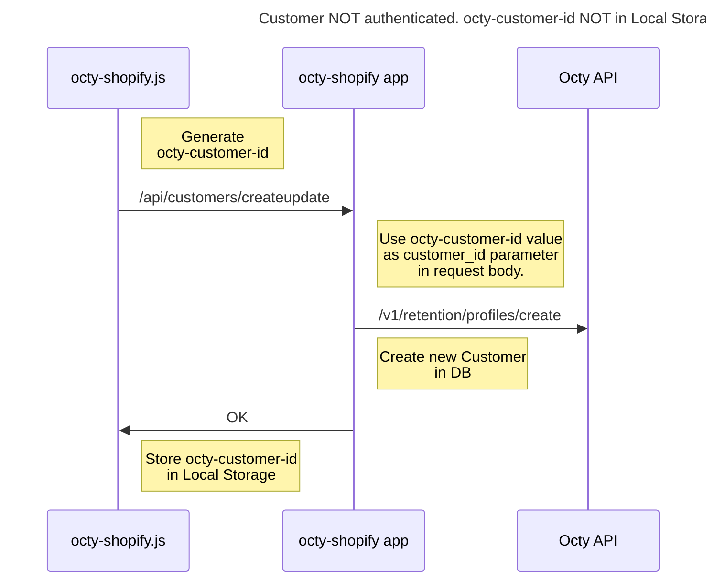
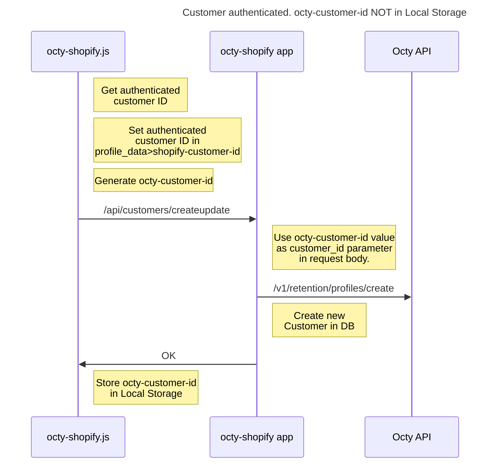
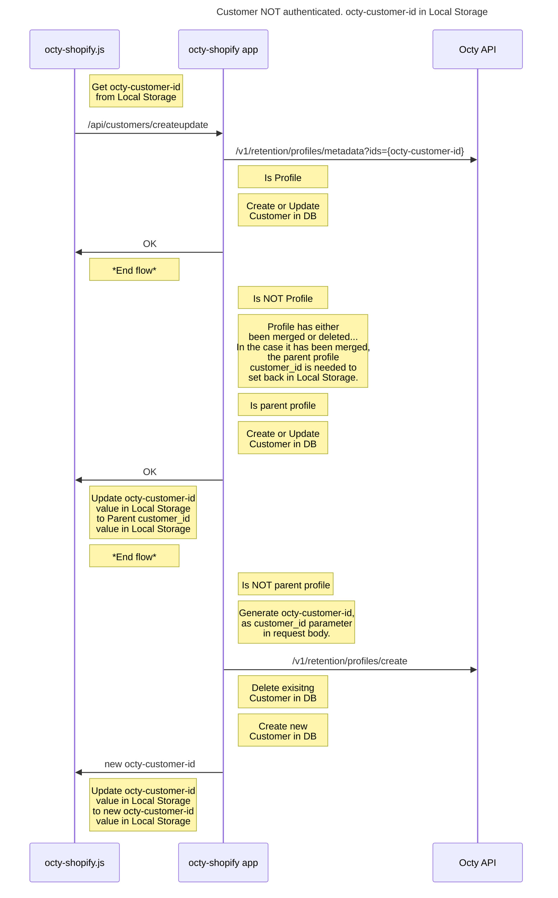
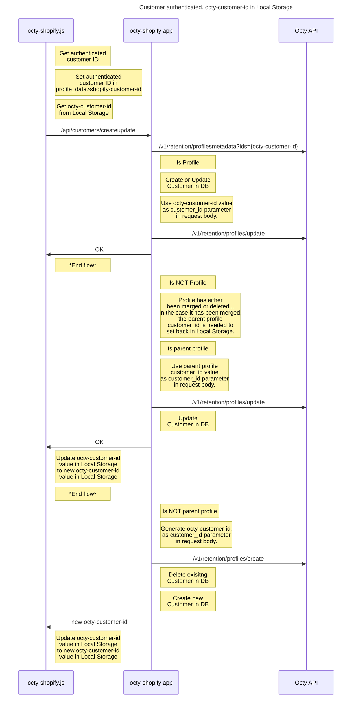
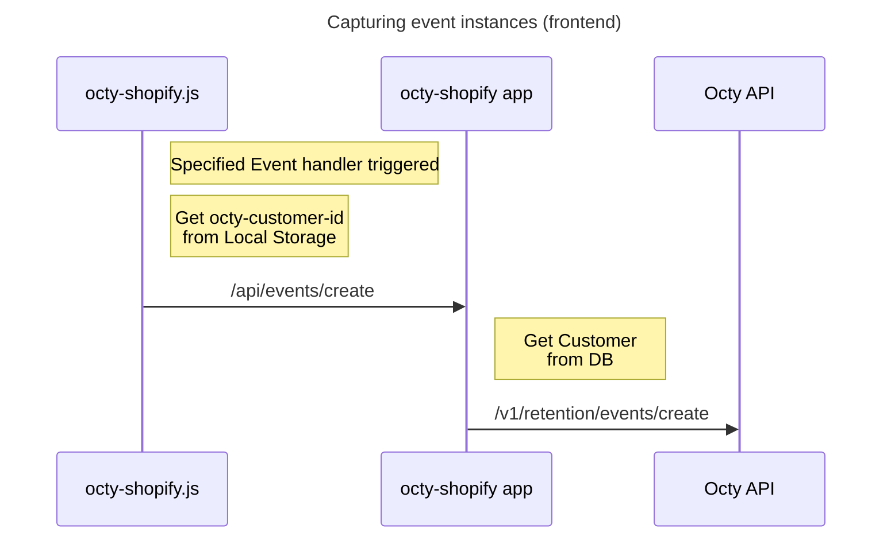
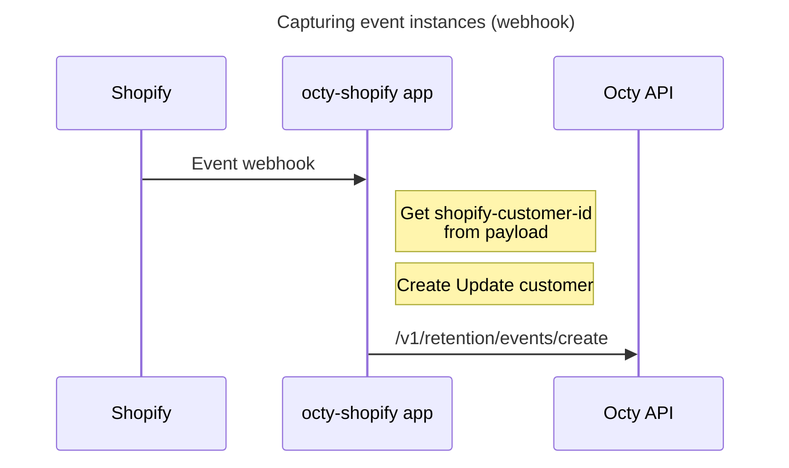
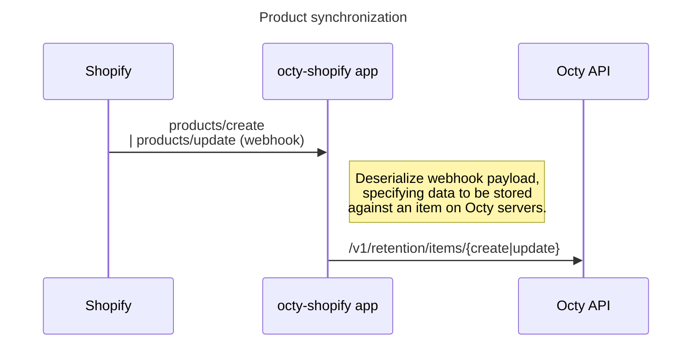
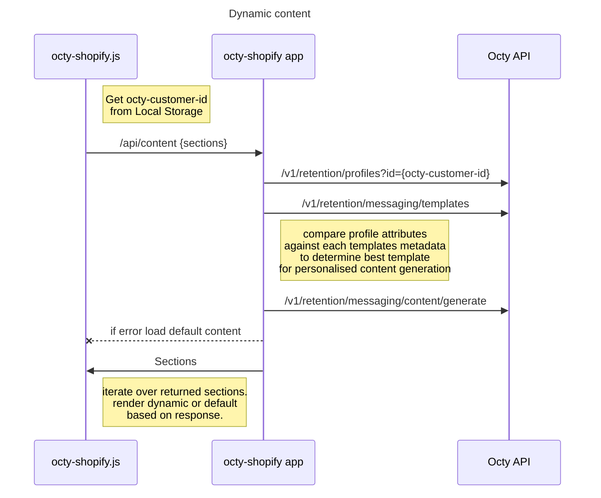
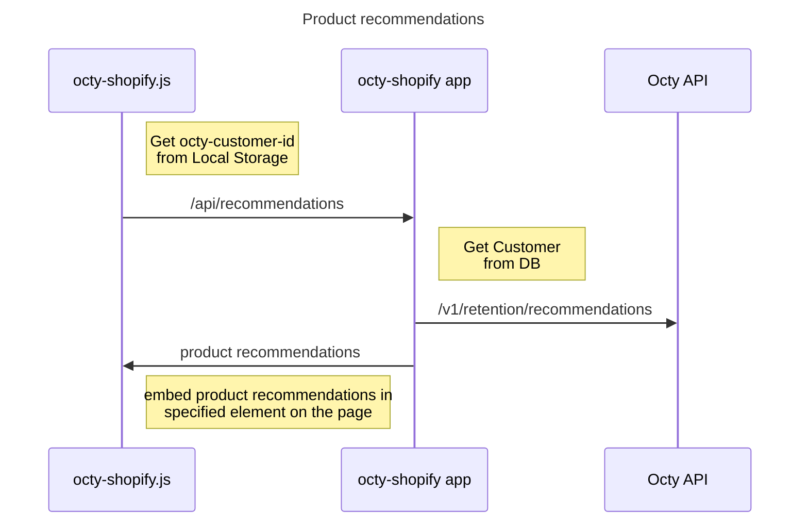
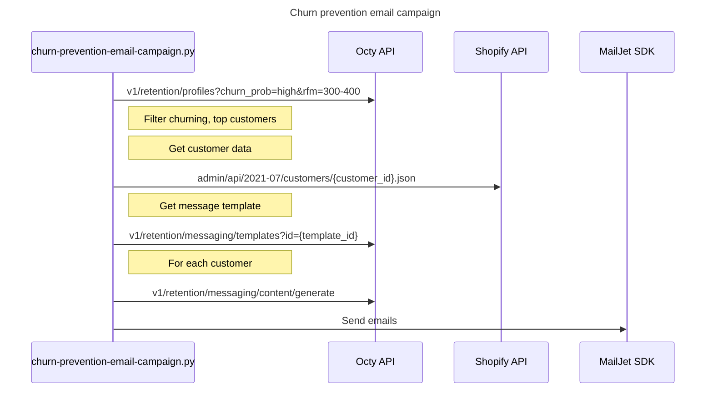

## Octy <> Shopify Demo


This repository contains three modules that make up a fundamental Octy integration into a Shopify store.

- (Backend) Shopify Private Application (octy-shopify golang application)
- (Frontend) octy-shopify-client (Javascript) & octy-shopify sections (liquid)
- (Backend-Processes) churn-prevention-email-campaign (python script)

We have also included a demo store export (*./theme_export__octymerch-myshopify-com-dawn*) allowing you to view the changes made to our demo Shopify Store; giving you the full picture of an integration. Search the *./theme_export__octymerch-myshopify-com-dawn* directory for the follwoing tag "**OCTY-EDIT**" to find and view each edit within the stores .liquid files.

This project has been created to showcase some of the possible flows and functionalities Octy enables on a Shopify store.

> DISCLAIMER

The code in this repository should not be considered production-ready and is simply intended to showcase some of Octy's features and a basic approach to an integration. Also note, there are no authentication protocols defined. We advise, in production, that you handle auth between both Shopify servers (using a webhook secret) and any front end scripts that communicate with your private Shopify applications.

To learn more about what Octy is and how it can boost your store’s revenue go here -> https://octy.ai/docs

  

## Octy demo flows

This demo showcases the following flows:

- Tracking and merging Anonymous & Authenticated customer sessions

- Capturing event instances (front end)

- Capturing event instances (webhook)

- Product synchronization

- Dynamic content (personalisation)

- Personalised product recommendations

- Churn prevention email campaign

  
  

## Prerequisites

  

### Octy API Keys

Two API Keys, Public_key and Secret_key, are generated and sent to the account holder via email on the successful account creation.

**Want some keys?**

Contact our sales team to find out more: https://octy.ai/contact

  

### Shopify API Keys

Log in to your Shopify admin and create a new private Shopify app called 'octy-shopify-demo' > https://{your-store-name}.myshopify.com/admin/apps/private/new

Set the following application permissions:

Admin API:

- Customers [read access]
- Product listings [read access]
- Products [read access]
  
### Node & npm
Node and npm are required to bundle and minify the frontend octy-shopify client using webpack.
More on webpack here -> https://webpack.js.org/
Node & npm dowload -> https://docs.npmjs.com/downloading-and-installing-node-js-and-npm

### Docker (optional)
Docker can be used to run the backend golang application inside a container.  A docker file is included in this repo.
If you do not have it already, download a docker desktop client here -> https://www.docker.com/products/docker-desktop

## Usage

  
### Anonymous customer sessions

In order to track and merge unauthenticated, anonymous customer sessions with Octy, anonymous customer identifiers should be generated. These identifiers can then be used as the value for the customer_id parameter within a request body when creating Octy profiles. In this demo, anonymous customer identifiers are generated using the following format: *octy-customer-id-xxxxxxxx-xxxx-xxxx-xxxx-xxxxxxxxxxxx* 

This approach of generating anonymous customer identifiers is required when there are scenarios in which your customers can interact with your store without being authenticated. However, if customers are required to be authenticated across all sections of your store, you can simply default to using their shopify generated customer ID.

The process of tracking and merging anonymous customer sessions is illustrated in more detail below in the *Octy demo flow diagrams>Tracking and merging Anonymous & Authenticated customer sessions flows* section of this Readme file.


### (Backend) octy-shopify application

*Prerequisites*

**configurations**

Set all required configurations in the *pkg/config/config.yaml* file.
Each required configuration is marked with #required.
NOTE: If you are running this application locally, make use of Ngrok -> https://ngrok.com/ for Shopify webhook integrations.

**Shopify Webhooks**

This application relies on Shopify webhooks to sync product data with Octy servers and to capture event instances for event types that would be tricky or unrealiable to capture from the frontend, such as 'orders'.

To set the required webhooks on your Shopify store, execute the following cURL commands (replace store-name and host values):

```
curl --location -g --request POST 'https://{store-name}.myshopify.com/admin/api/2021-07/webhooks.json' \
--header 'Content-Type: application/json' \
--header 'X-Shopify-Access-Token: {shopify-api-secret}' \
--data-raw '{
"webhook": {
		"topic": "orders/paid",
		"address": "https://{host | ngrok_tunnel}/api/hooks/events/charge/create",
		"format": "json"
	}
}'
```

```
curl --location -g --request POST 'https://{store-name}.myshopify.com/admin/api/2021-07/webhooks.json' \
--header 'Content-Type: application/json' \
--header 'X-Shopify-Access-Token: {shopify-api-secret}' \
--data-raw '{
	"webhook": {
		"topic": "products/create",
		"address": "https://{host | ngrok_tunnel}/api/hooks/items/create",
		"format": "json"
	}
}'
```

```
curl --location -g --request POST 'https://{store-name}.myshopify.com/admin/api/2021-07/webhooks.json' \
--header 'Content-Type: application/json' \
--header 'X-Shopify-Access-Token: {shopify-api-secret}' \
--data-raw '{
	"webhook": {
		"topic": "products/update",
		"address": "https://{host | ngrok_tunnel}/api/hooks/items/update",
		"format": "json"
	}
}'
```

For more on configuring Shopify webhooks: https://shopify.dev/apps/webhooks/configuring

**Application Database**
This demo utilizes a lightweight, embedded SQLite database instance to persist and track anonymous & authenticated customer sessions. On running the application, an SQLite database file will be generated automatically. In production, we advise that you follow a similar schema (defined below) in your DB.

```
DB Schema
---------
| Tbl Name  | Column               | Type         | Nullable | Example                   | Comments                    |
|-----------|----------------------|--------------|----------|---------------------------|-----------------------------|
| Customers | ID                   | INTEGER      | false    | 1                         | PRIMARY KEY, AUTO INCREMENT |
| Customers | octy_customer_id     | VARCHAR(255) | false    | octy-customer-id-1234     |                             |
| Customers | octy_profile_id      | VARCHAR(255) | false    | profile_id-1234           |                             |
| Customers | shopify_customer_id  | VARCHAR(255) | true     | 1234567889765544445       |                             |
| Customers | CreatedAt            | DATETIME     | false    | 01/01/21T00:00:00         |                             |
| Customers | UpdatedAt            | DATETIME     | true     | 01/01/21T00:00:00         |                             |
```

*Running the application*

**Docker**

```
cd ./octy-shopify
docker build -t octy-shopify:latest .
docker run -p 8080:8080 octy-shopify:latest

--

# -p <hostPort:containerPort>
#NOTE: hostPort must match the app>port specified in pkg/config/config.yaml.
#NOTE: containerPort must match the port Ngrok tunnels to.
```

**Start manually**

```
cd ./octy-shopify
go run ./cmd
```

##


### (Frontend) Octy-shopify client

*Prerequisites*

**configurations**

Set the required configuration in the *frontend/octy-shopify-client/src/config/endpoints.js* file.
Update the value of the variable called '*octyAppHost*' to the backend applications host URL, or Ngrok URL and save.

Once you have set the required configuration, You must create a new file called '*octy-shopify.js'* on your Shopify store, under assets.

Follow these steps to do so:

- Log in to your Shopify store admin section

- Under 'sales channels' in the left hand menu, go to: Themes > Actions (drop down) > Edit code > Under 'assests' > 'Add new asset'.
- Name this file 'octy-shopify.js', leave it empty and save.

- Under layout > open 'theme.liquid'

- Add the following lines inside the < head > tags, and save:

```
<script src="https://cdnjs.cloudflare.com/ajax/libs/jquery/3.2.1/jquery.min.js"></script>
<script src="{{ 'octy-shopify.js' | asset_url }}></script>
```

In the following steps (as you integrate Octy into your store) you will update the contents of the '*octy-shopify.js'* file located under your stores assets.
It is important that after each edit made to the  octy-shopify client project, that you rebundle it using webpack and copy the contents of the outputted *frontend/octy-shopify-client/dist/octy-shopify.js* file to the octy-shopify.js file located on your Shopify store. 

When you are required to **redeploy the octy-shopify client** (as marked in this Readme), follow these steps to do so :

- cd to frontend/octy-shopify-client
- run the command : ```npm i --include=dev```
- run the command : ```npm run build```

- Copy the contents of the file '*frontend/octy-shopify-client/dist/octy-shopify.js*'  into the asset file 'octy-shopify.js' located on your Shopify store and save.


**Adding an Octy product recommendation section**

Refer to https://octy.ai/docs/recommendations for more on how Octy enables product recommendations.

To display product recommendations generated by Octy on your Shopify store, you must create a new section called '*octy-product-recommendations.liquid'*.

*Follow these steps to do so:*

- Log in to your Shopify store admin section

- Under 'sales channels' in the left hand menu, go to: Themes > Actions (drop down) > Edit code > Under 'sections' > 'Add new section'

- Copy the contents of the file '*frontend/octy-shopify sections/octy-product-recommendations.liquid*' from this repo into the new section file and save.

- Under 'sales channels' in the left hand menu, go to: Themes > 'Customize' > left hand menu 'Add section' > select 'octy-product-recommendations' and save.
  
  *NOTE: deploy the octy-shopify client after creating octy-product-recommendations.liquid section*

**Capturing event instances (frontend)**

Refer to https://octy.ai/docs/creating_resources#Creating%20events for more on how Octy handles events data.

The octy-shopify-client registers javascript event listeners by identifying HTML elements that have specified data attributes, for example:

```
Synatax:
<{element-type} data-octy-event-{event-listener-type}="{event-type}"></{element-type}>

Example:
<button data-octy-event-click="showed-love"></button>
```

On load of a view, for each element that has a '*data-octy-event-click="showed-love"*' attribute within said view, a 'click' event listener would be registered. On click of one of these elements, an event instance of type 'showed-love' would be captured and pushed to the octy-shopify backend app >then to> the Octy API. Refer to the 'OctyEventManager.registerEventListeners()' method in the *frontend/octy-shopify-client/src/index.js* file to see how this works in practice.

In this demo, two event listener types are specified ['mouseenter', 'click'], however this approach will work with most javascript event listener types. Go here to see more on javascript event listeners -> https://developer.mozilla.org/en-US/docs/Web/Events

*NOTE: redeploy the octy-shopify client after specifying event listeners*

**Rendering dynamic personalised content**

In relevant sections of your Shopify theme, you can specify HTML elements that will be capable of rendering personalised content.

You can specify which HTML elements should support dynamic content capabilities using Octy by following these steps.


1. For each section you wish to enable dynamic content for, you must specify a section_id and a corresponding default value within the object array '*DCSMap*'. This variable is located in the *frontend/octy-shopify-client/src/config/DCSMap.js* file. The default value specified for each section is what will be rendered, inside the specified HTML element, in the event of an error or no dynamic content being returning by the octy-shopify app.

Example:

```
//Dynamic Content Section Map
const DCSMap = [
	{
		'section_id' : 'banner-title',
		'default_value' : 'Welcome to our store!'
	},
	{
		'section_id' : 'banner-cta',
		'default_value' : 'Buy some stuff!'
	},
	{
		'section_id' : 'banner-image',
		'default_value' : "" // Default values can be HTML elements
	},
	{
		'section_id' : 'promo-banner', //NOTE: for this section to be rendered, you must add 'octy-promo-banner.liquid' section to your store.
		'default_value' : '' // if default value is empty string, section will not be rendered
	}
];
```

2. In your Shopify stores liquid files, you should add the following for each dynamic content section to specify which declared section_id(s) correspond with which HTML elements(s).

```
Syntax:
<{element-type} data-octy-content="{section_id}">{dynamic content rendered here!}</{element-type}>

Example:
<h1 data-octy-content="banner-title"></h1>
<a data-octy-content="banner-cta" href="https://xxxx.xxx"></a>
<div data-octy-content="banner-image"></div>
<div data-octy-content="promo-banner"></div>
```

Using the above example, On load of a page containing these HTML elements, the octy-shopify backend app would attempt to determine if any suitable message templates exist that could be used to render personalised content based on your business rules and defined customer personas. If any are found, the content is returned and rendered inside each specified HTML element. This flow is illustrated in more detail below in the 'Octy demo flow diagrams' section of this readme file. You can also refer to the 'OctyContentManager' class in *frontend/octy-shopify-client/src/index.js* file to see how this works in practice.
When adding Octy powered dynamic content sections into your own store, you could create logic that is capable of rendering dynamic content based on any profile attribute. These attributes include: segment tags, profile data & platform info attributes, rfm score, churn probabiltiy and whether the customer is a paying customer or not. This allows you to make each interaction with your website tailored to each defined customer type.

*NOTE: redeploy the octy-shopify client after editing the DCSMap*
##

### (Backend-Processes) Churn prevention email campaign script

This basic python script showcases the use of the Octy API to automate a churn-prevention email campaign; selecting your top customers who have been flagged by Octy as 'churning' and sending them personalised emails using personal data from the Shopify API and content generated by the Octy messaging API.

For this demo, Mailjet has been used as the email service provider, however, any email service provider can be used in its place.

Follow the notes and TODO's specified in the *backend-processes/churn-prevention-email-campaign.py* file in this repo to get this script up and running.

```
pip install 'mailjet-rest==1.3.4'
python3 backend-processes/churn-prevention-email-campaign.py
```

  

## Octy demo flow diagrams


  

Every 48 hours the Octy profile identfication module merges profiles, including their respective event instances and profile attributes. Profile are merged by matching the value of the specififed authenticated-id-key set in each anonymous profiles profile_data attribute. You can specify the name of the authenticated-id-key that the Octy profile identfication module will use to merge profiles by updating your Octy <a  href="https://octy.ai/docs/api#AccSetConfigurations">account configurations.</a> (in this demo. the name of the authenticated-id-key is: shopify-customer-id)

Tracking and merging Anonymous & Authenticated customer sessions flows:

##



##




##

##

Event instance capture flows:



##




##
Product data flow:


##
Dynamic content flow:


##
Product recommendations flow:


##
Backend script flows:


# License


Copyright (c) Octy LTD. All rights reserved.

Licensed under the  <a href="https://www.apache.org/licenses/LICENSE-2.0.txt">Apache License 2.0 license</a>. 

# Author

Ben Goodenough, 
CEO & Founder Octy LTD